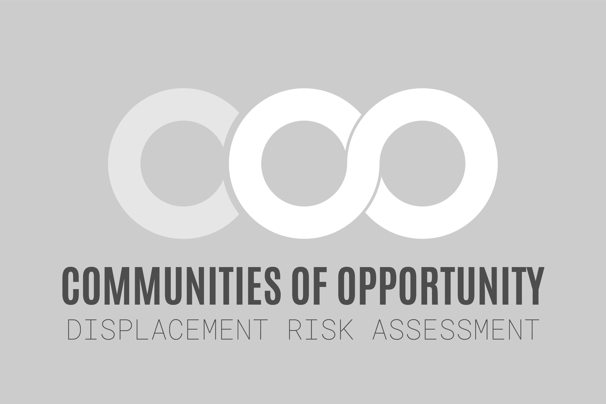

---   
site: bookdown::bookdown_site
output:
  bookdown::gitbook:
    df_print: paged
documentclass: book
bibliography: ["coo.bib"]
csl: planning-perspectives.csl
---

# {-}

 

**Note: this document is a work in progress**

The Community of Opportunity (COO) program is a platform for coordinating and supporting efforts to address systemic inequities in communities within Washington’s King County. The COO Data Workgroup is collection of representatives from the COO partners whose task is to develop data-driven strategies to describe, measure, and address conditions that need to be improved in each of the participating communities.

The COO Displacement team formed as a subgroup of the COO Data Workgroup. The subgroup’s first meeting convened on March 10, 2016 with the goal of developing an explicit method for assessing displacement in the COO communities. The following sections provide a summary of the team’s discussion and their proposal to the Data Workgroup on March 24, 2016.

Members of the displacement team expressed a shared interest in developing an approach that built upon existing methods from the body of research and case studies. The 2015 literature review published by UCLA/UC Berkeley  researchers Zuk et al. provided an extensive foundation from which to assemble a set of methods that suit the COO project’s specific situation and requirements. The team compared the merits of individual indicator methods with those of composite index methods, and decided on an approach that incorporates parts of both strategies.

The proposed method would adopt the displacement susceptibility methodology developed by researcher Lisa Bates and employed in Portland, OR; the San Francisco Bay Area, CA; and elsewhere. This approach uses a composite index of widely-available data sources to assess displacement susceptibility of communities. The index score is measured at the Census tract scale and categorizes the populations using a typology of displacement phases, each of which might be addressed by different policy strategies. A key limitation of this approach (and many others like it) is that it doesn’t measure residential displacement itself, and therefore is more complicated to interpret and different in nature from other COO Headline Indicators which are more direct in nature.

The displacement team proposed a combination of the Bates susceptibility index (referred to below as the “Baseline”) with a set of anecdotal (“Drill Down”) indicators. This combination is a strategic choice based on the following three dynamics of this project:
  1. The challenge of finding relevant data that is frequently updated 
  2. The need to strike a balance between using consistent methods and addressing the specific situations of the three sites
  3. The need to expand the definition of displacement beyond the topic of housing to consider cultural institutions (including but not limited to small businesses, community centers, and health clinics)

The Baseline is composed of indicators that can be updated every five years and will provide a consistent system of assessing, comparing, and supporting the three sites. The Drill Down indicators can be flexibly adapted to best suit each of the sites and will provide anecdotal insight into displacement conditions which can be monitored on an annual basis. Finally, changes in the presence of community institutions will be tracked using a selection of business types from the comprehensive list included in the North American Industry Classification System (NAICS).
